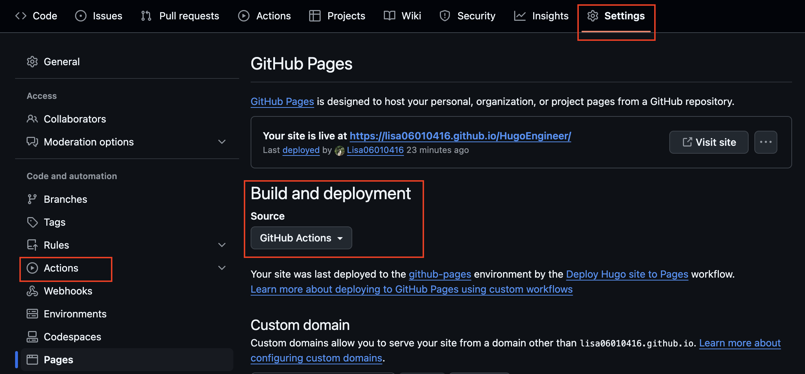
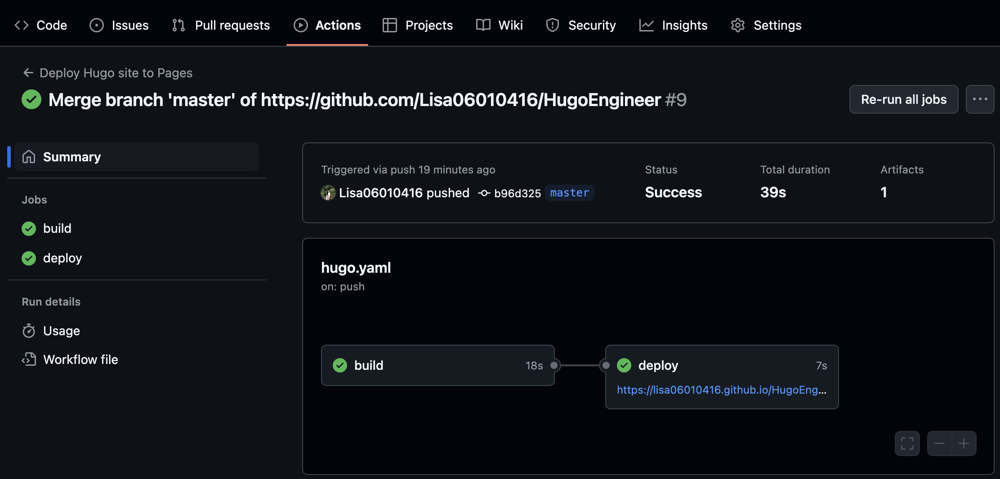

Have you ever wanted to showcase your ideas and projects on a personal website, but the costs of hosting stopped you? Good news: with GitHub Pages and Hugo, you can build your very own website for free! It's simple, powerful, and perfect for sharing your unique voice with the world.

In this post, I’ll guide you through four straightforward steps:

1. Setting up your site on GitHub Pages
2. Adding a new post
3. Customizing your site with a new theme
4. Insert Image to your post

Let’s get started and bring your personal website to life!

> You can see more information on [Hugo](https://gohugo.io/)

# Setting up your site on GitHub Pages

#### Install git, hugo
 [Install Hugo](https://gohugo.io/installation/) 

 [Install Git](https://git-scm.com/book/en/v2/Getting-Started-Installing-Git)

<br/>

#### Init setting

```
hugo new site YourSiteName --format yaml
cd YourSiteName
git init
git submodule add https://github.com/theNewDynamic/gohugo-theme-ananke.git themes/ananke
echo "theme: 'ananke'" >> hugo.toml

```

<br/>

#### Enable GitHub Pages and Setting hugo.yaml

Github topbar setting>page and change the source to Action



Create a file .github/workflows/hugo.yaml and paste below Hugo demo setting into the file. Make sure the branch name is align your git repo setting.

```yaml

# Sample workflow for building and deploying a Hugo site to GitHub Pages
name: Deploy Hugo site to Pages

on:
  # Runs on pushes targeting the default branch
  push:
    branches:
      - main

  # Allows you to run this workflow manually from the Actions tab
  workflow_dispatch:

# Sets permissions of the GITHUB_TOKEN to allow deployment to GitHub Pages
permissions:
  contents: read
  pages: write
  id-token: write

# Allow only one concurrent deployment, skipping runs queued between the run in-progress and latest queued.
# However, do NOT cancel in-progress runs as we want to allow these production deployments to complete.
concurrency:
  group: "pages"
  cancel-in-progress: false

# Default to bash
defaults:
  run:
    shell: bash

jobs:
  # Build job
  build:
    runs-on: ubuntu-latest
    env:
      HUGO_VERSION: 0.137.1
    steps:
      - name: Install Hugo CLI
        run: |
          wget -O ${{ runner.temp }}/hugo.deb https://github.com/gohugoio/hugo/releases/download/v${HUGO_VERSION}/hugo_extended_${HUGO_VERSION}_linux-amd64.deb \
          && sudo dpkg -i ${{ runner.temp }}/hugo.deb          
      - name: Install Dart Sass
        run: sudo snap install dart-sass
      - name: Checkout
        uses: actions/checkout@v4
        with:
          submodules: recursive
          fetch-depth: 0
      - name: Setup Pages
        id: pages
        uses: actions/configure-pages@v5
      - name: Install Node.js dependencies
        run: "[[ -f package-lock.json || -f npm-shrinkwrap.json ]] && npm ci || true"
      - name: Build with Hugo
        env:
          HUGO_CACHEDIR: ${{ runner.temp }}/hugo_cache
          HUGO_ENVIRONMENT: production
          TZ: America/Los_Angeles
        run: |
          hugo \
            --gc \
            --minify \
            --baseURL "${{ steps.pages.outputs.base_url }}/"          
      - name: Upload artifact
        uses: actions/upload-pages-artifact@v3
        with:
          path: ./public

  # Deployment job
  deploy:
    environment:
      name: github-pages
      url: ${{ steps.deployment.outputs.page_url }}
    runs-on: ubuntu-latest
    needs: build
    steps:
      - name: Deploy to GitHub Pages
        id: deployment
        uses: actions/deploy-pages@v4

```

<br/>

#### Push change to your git repo

```
git add . && git commit -m 'init hugo' -a && git push
```

#### View your domain on git action:
Click the link on deply button and then you can see yourown website at https://yougitname.github.io/...

# Adding a new post

Add markdown content
```
hugo new content content/posts/my-first-post.md
```

And Hugo will create a .md file content/posts/your_post_name.md, like below. And make sure you chant the deaft = true to false.
```
---
date: 2024-12-28T16:13:31+08:00
draft: false 
title: 'Use Hugo and Github Page Build Personal Website' 
---

(Add your content here ...)
```

Run below command to build your draft to html
```
hugo server --buildDrafts
```

Push change to your git repo
```
git add . && git commit -m 'new hugo content page' -a && git push
```

# Customizing your site with a new theme


#### Change website title 

Modify hugo.toml. The baseURL notwork when deploy by github page so ignore it. Change the title if you need.

```
baseURL: "https://example.org/"
languageCode: "en-us"
title: "My New Hugo Site"
theme: 'ananke'
```

<br/>

#### Change Theme

Go to [Hugo theme](https://themes.gohugo.io/) and select s style you like and select ont them you like. Click the download button will see the install instruction. 

Here is an example to change the theme to [PaperMod](https://themes.gohugo.io/themes/hugo-papermod/).

In most situation like you can download it by git command like:

```
git submodule add https://github.com/adityatelange/hugo-PaperMod themes/PaperMod
```

Change theme setting at hugo.toml:

```
baseURL: "https://example.org/"
languageCode: "en-us"
title: "My New Hugo Site"
theme:
  - PaperMod
```

Push to your git repo

```
git add . && git commit -m 'change theme' -a && git push
```


# Insert Image to your post

Create sub-directory under the `post/` directory, move your Markdown file into it, and rename the Markdown file to `index.md`.

Put the image you want to display on the website into the same sub-directory under an `images/` folder, as shown below:

```
- content
  - post
    - post dire 
    	- index.md
    	- images
    	  - image1.png
```

To insert the image in your Markdown file, use the following syntax:

```

```


